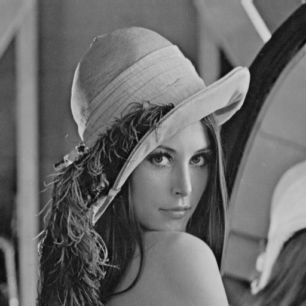
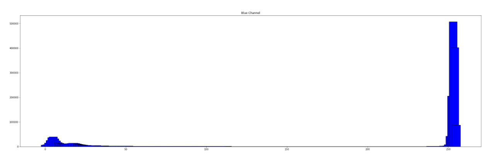
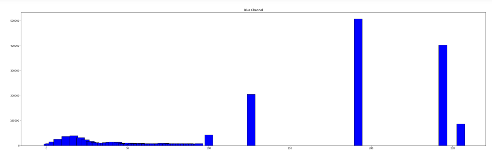

# SBE 404B - Computer Vision

## CV_Task 1

**Team 3**

**Submitted to: Dr. Ahmed Badwy and Eng. Mohamed Adel**

Submitted by:

|              Name              | Section | B.N. |
|:------------------------------:|:-------:|:----:|
|   Esraa Mohamed Saeed   |    1    |   10  |
|   Alaa Tarek Samir   |    1    |  12  |
| Amira Gamal Mohamed  |    1    |  15  |
|   Fatma Hussein Wageh   |    2    |  8  |
| Mariam Mohamed Osama |    2    |  26  |

**The programming langusage is Python**

### Libraries that we used
- Numpy (*python library*)
- Matplotlib (*python library*)
- import_ipynb
- any other libraries here

### Task Idea

In this task, we implement major computer vision algorithms on color and grayscale images using python language such as:
- Adding noise to the image (Uniform, Gaussian,Salt and pepper noise)
- Filtering the noisy image with low pass filters(Average, Gaussian,Median filters)
- Detecting the edge of images by(Sobel,Robert,Prewitt,Canny)
- Getting the histogram and cumulative distribution curve of images
- Equalizing the image
- Normalizing the image
- Local and Global Thresholding
- Transformation from color image to grey scale and getting the R,G,B histograms,distribution curves and histogram equalization
- Frequency domain filters(high pass and low pass)
- Hybrid images

**Adding noise to the image**
- In This part we implemented 3 functions to add noise to the images which are:
1. Salt and peppers noise: adds black and white pixels randomly in the image based on a propability and threshold 
2. Gaussian Noise: adds normally distributed noise to the original image
3. Uniform Noise: adds uniformally distributed noise to the image

- Here's 2 examples of an original image vs. it's noises (both grayscale and rgb):

**Filtering the noisy image with low pass filters**

- In This part we implemented 3 functions to Filter the noise on images which are:
1. Gaussian Filter: Creates a kernal of a size which depends on the sigma chosen (we picked 1 by trial and error) and convolve it with the original image
2. Median Filter: Creates a kernal of (3x3) size, sort the 9 values and replace the center (targeted) pixel with the median value (of position 4)
3. Avarage filter: Creates a (3x3) kernal, each value = 1/9 (1/sum) and convolve it with the original image

- Here's 2 examples of a noised image (with salt and peppers, you can change with the filter you want) vs. the filtered images (both grayscale and rgb):

**Detecting the edge of images**
- Edge detection is an image processing technique for finding the boundaries of objects within images, It works by detecting discontinuities in brightness and used for image segmentation and data extraction.
- In this task we used Sobel, Prewitt, Roberts and Canny.
- Sobel, Prewitt and Roberts made by convolving its kernals to the image direct 
- In Canny we need to smooth the image with gauusian, get the gradient magnitude and direction, then apply non-max suppression and finally apply hysteresis threshold. 

**Histogram and Distribution curve**
- A histogram is a graphical representation that shows the total number of each intensity in the image.
- We can represent it as continuous or discrete curve and we can also represent it as bars.
- The cumulative distribution curve mainly shows the trend of the data that we draw, it mainly shows the probability.
- Here we will show the histogram and cumulative distribution curve on grey image and we will show the histogram of color image again in point **8**.

#### The original grey image

### Different representations of histogram(discrete,continuous,bars) 

### Cumulative curve

**Equalization**
- The equalization of the image is to make the total number of each intensity is closer to the others as much as possible.
- Here we will show the histogram equalization curve on grey image and we will show the histogram equalization of color image again in point **8**.
  
#### The original grey image before equalization

### The grey image after equalization 

### The histogram of the new image
- Here we will see that the number of each intensity is closer to the others as much as possible.

**Normalization**
- It is the process to change the range of the image
- There is 2 approaches:
   by max and minimum equation :
     norm_img=(((Intensity-min_c)/(max-min))*(newmax-newmin))+newmin
   by mean and standard deviation:
      norm_img=(Intensity-mean)/stddev

#### The original grey image before normalization

### The grey image after normalization(max:100,min:10) 

### The difference between original and normalized image(image-normalized)

### The grey image after normalization(mean,std) 

#### The original color image before normalization

### The color image after normalization(max:255,min:100) 

### The difference between original and normalized image(image-normalized)

### The color image after normalization(mean,std) 

**Histogram, districution curve and Equalization of color image**

#### The original color image 

### The histogram for the 3 channels

### The R channel histograms and distribution curves

### The G channel histograms and distribution curves

### The B channel histograms and distribution curves

### The hisogram equalization of the image

### The R channel histogram

### The G channel histogram

### The B channel histogram

### Global and local Thresholding

- The original grey image before Thresholding

- Global Thresholding
  
  We choose the values that we want to keep and make the others take zero values and binarize the image

- Local Thresholding

  It is used to separate desirable foreground image objects from the background based on the difference in pixel intensities of each region(SxS).

  It selects an certain threshold for each pixel based on the range of intensity values in its local neighborhood. 
  
  we used the bradley local threshold technique with the integral image

### Convert from RGB to gray scale

- We used the equation: 
  
  **GrayscaleImage = 0.299 * Red + 0.587 * Green + 0.114 * Blue**
  to convert RGB image to gray scale

- The original color image 

- The gray image

### Frequency low pass filter and low pass filters

- for high pass filter
 We applied the High pass (sobel) mask to the image.
 Perform FFT to (the image and the mask) ,multiply them,then inverse fft.

 -Einstyen Image

- for low pass filter
 We applied the High pass (Average) mask to the image.
 Perform FFT (the image and the mask) ,multiply them,then inverse fft.

 - Marlyn Image

### Hybrid images

- We use gaussian low pass filter for one image(Marlyn) and sobel high pass filter for the another one(Einstyen) and then we sum the result of both filters to get the hybrid image 

- when we are close to the image, we will see the high pass filter image and when we will be far from image, we will see the low pass filter image

-Einstyen Image

- Marlyn Image

-The hybrid one

